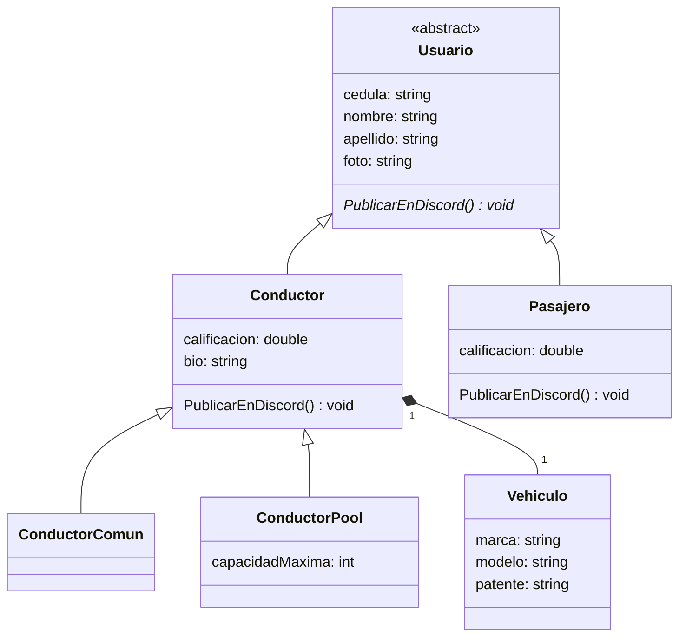

```mermaid
classDiagram
  class Usuario {
    <<abstract>>
    cedula: string
    nombre: string
    apellido: string
    foto: string
    PublicarEnDiscord()* void
  }
  class Conductor {
    calificacion: double
    bio: string
    PublicarEnDiscord() void
  }
  class Pasajero {
    calificacion: double
    PublicarEnDiscord() void
  }
  class ConductorComun
  class ConductorPool {
    capacidadMaxima: int
  }
  class Vehiculo {
    marca: string
    modelo: string
    patente: string
  }
  Usuario <|-- Conductor
  Usuario <|-- Pasajero
  Conductor <|-- ConductorComun
  Conductor <|-- ConductorPool
  Conductor "1" *-- "1" Vehiculo
```
